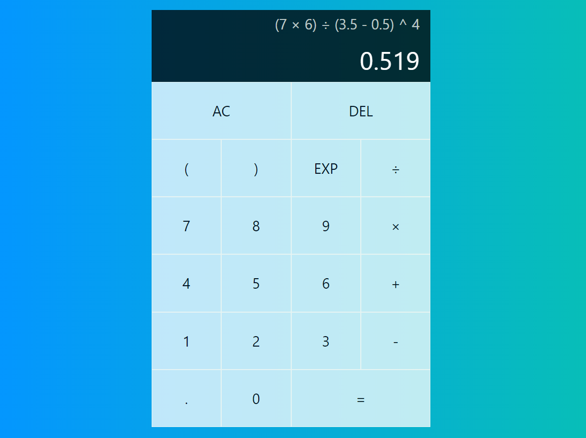

## **Simple Calculator**

The purpose of building this calculator was to practice **TailwindCSS** and **ReactJS**.

The style/design of the calculator is inspired by _Web Dev Simplified_ on Youtube.

Instead of building it with Vanilla CSS, I used Tailwind to style the entire application.

Apart from that, I built the functionalities (React code) of the calculator **_all by myself_**.

  

  

